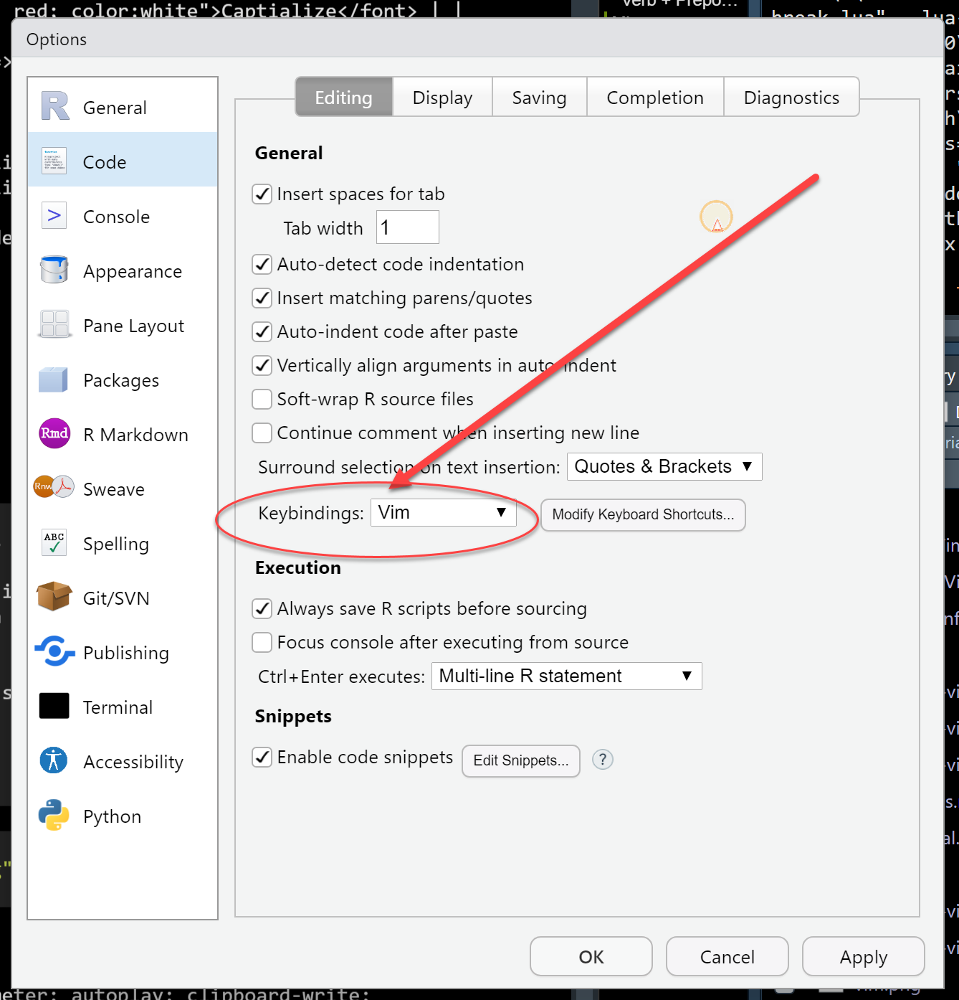

:::: {style="display: flex; column-gap: 3px"}

::: {}


| <font style="background-color: red; color:white">Exit</font> | |
| -------------- | -------------------------------- |
| `:w`           | Save                             |
| `:wq` _/_ `:x` | Save and close file              |
| `:q`           | Close file                       |
| `:q!`          | Close file, abandon changes      |
| `Esc`             | Exit insert mode |


| <font style="background-color: red; color:white">Visual</font> | |
| ---      | ---                     |
| `v`      | Enter visual mode       |
| `V`      | Enter visual line mode  |
| `<C+v>`  | Enter visual block mode |
| <font style="color: blue">In Visual Mode</font>| |
| `d` _/_ `x` | Delete selection        |
| `s`         | Replace selection       |
| `y`         | Yank selection _(Copy)_ |

See [Operators](#operators) for other things you can do.

| <font style="background-color: red; color:white">Macros</font> | |
| ---      | ---                     |
| `qa` | record macro a |
| `q` |  stop recording macro |
| `@a` | run macro a |
| `@@` | rerun last run macro |


| <font style="background-color: red; color:white">Search/Replace</font> | |
| ---      | ---                     |
| `/`pattern | search for pattern |
| `?`pattern | search backward for pattern |
| `n` | repeat search in same direction |
| `N` | repeat search in opposite direction |
| `:%s/old/new/g` | replace all old with new throughout file |
| `:%s/old/new/gc` | with confirmations |
| <font style="color: blue">Search Range</font>| |
| `.` |  the current line
| `$` |  the last line in the file
| `%` |  the whole file. The same as `1,$`


:::

<!--end of first col-->

::: {}

| <font style="background-color: red; color:white">Navigate</font> | |
| ---                 | ---               |
| <font style="color: blue">Character</font>| |
| `h` `j` `k` `l`     | Arrow keys        |
| <font style="color: blue">Word</font>| |
| `b` _/_ `w`  | Previous/next word        |
| `ge` _/_ `e` | Previous/next end of word |
| <font style="color: blue">Line</font>| |
| `0` _(zero)_ | Start of line                      |
| `^`          | Start of line _(after whitespace)_ |
| `$`          | End of line                        |
| <font style="color: blue">Character</font>| |
| `fc`  | Go forward to character `c`  |
| `Fc`  | Go backward to character `c` |
| `;`  |  repeat previous f, F movement
| `,`  |  repeat previous f, F movement backwards
| <font style="color: blue">Document</font>| |
| `gg`     | First line     |
| `G`      | Last line      |
| `:n`     | Go to line `n` |
| `nG`     | Go to line `n` |
| <font style="color: blue">Screen</font>| |
| `zz`     | Center this line         |
| `zt`     | Top this line            |
| `zb`     | Bottom this line         |
| `H`      | Move to top of screen    |
| `M`      | Move to middle of screen |
| `L`      | Move to bottom of screen |
| `<C+u>` _/_ `<C+d>` | Half-page up/down |
| `<C+b>` _/_ `<C+f>` | Page up/down      |
| <font style="color: blue">Mark</font>| |
| `ma`     | Mark this cursor position as `a` |
| \`a   | Jump to the marked position `a`  |
| <font style="color: blue">Match</font>| |
| `*`       | Next whole word under cursor        |
| `#`       | Previous whole word under cursor    |
| `%`                 | Nearest/matching `{[()]}`  |
| `[(` `[{` `[<`      | Previous `(` or `{` or `<` |
| `])`                | Next                       |


:::

<!--end of 2nd col-->

::: {}
| <font style="background-color: red; color:white">Edit</font> | |
| ---      | ---                                 |
| <font style="color: blue">Insert</font>| |
| `a`      | Append                              |
| `A`      | Append from end of line             |
| `i`      | Insert                              |
| `o`      | Open a new line below and insert |
| `O`      | Open a new line above and insert |
| <font style="color: blue">Deleta</font>| |
| `x`             | Delete character            |
| `dw`            | Delete word         |
| `dd`            | Delete line _(Cut)_         |
| <font style="color: blue">Substitute</font>| |
| `s`      | Substitute char and insert      |
| `S`      | Substitute line and insert          |
| <font style="color: blue">Change</font>| |
| `c`      | change |
| `C`      | Delete until end of line and insert |
| `r`      | Replace one character               |
| `R`      | Enter Replace mode                  |
| <font style="color: blue">Yank</font>| |
| `yy` |  yank (copy) a line |
| `2yy` | yank (copy) 2 lines |
| `ye` |  yank (copy) the characters of the word from the cursor position |
| `y$` |  yank (copy) to end of line |
| <font style="color: blue">Paste</font>| |
| `p`             | Paste                       |
| `P`             | Paste before                |
| <font style="color: blue">Join</font>| |
| `J`   | Join the next line to the current |
| <font style="color: blue">Capitalize</font>| |
| `~`      | Toggle case (Case => cASE)           |
| `gU`     | Uppercase                            |
| `gu`     | Lowercase                            |
| `gUU`    | Uppercase current line (also `gUgU`) |
| `guu`    | Lowercase current line (also `gugu`) |
| <font style="color: blue">Undo/Redo</font>| |
| `u`      | Undo changes                        |
| `<C+r>`  | Redo changes                        |


:::

::::


## Commanding your text editor

### (Numeric Qualifier +) Verb + Preposition + Noun

Operators (Verb) let you operate in a range of text (Noun) 
defined by *motion* (Preposition). 


:::: {style="display: flex;"}

::: {}

| Verb | Noun |
| ---      | ----        |
| `d`      | `w`    |
| Operator | Motion |


| <font style="background-color: red; color:white">Operator</font> | |
|----------|---------------------------------|
| `d`      | Delete                          |
| `y`      | Yank _(copy)_                   |
| `c`      | Change _(delete then insert)_   |

:::

::: {}


| Verb+Noun | Sentence
| ---                    | ---                                       |
| `d`_d_                 | _(repeat the letter)_ Delete current line |
| `d`_w_                 | Delete to next word                       |
| `d`_b_                 | Delete to beginning of word               |
| _2_`dd`                | Delete 2 lines                            |
| `d`_ip_                | Delete a text object _(inside paragraph)_ |
| _(in visual mode)_ `d` | Delete selection                          |


:::

::::


## Operand: Text objects

Text objects let you operate (with an *operator*) in or around text blocks (*objects*).


:::: {style="display: flex;"}

::: {}

### Grammar


| Operator | [i]nside or [t]ill | Text object |
| ---      | ---                  | ---         |
| `v`      | `i` `a` `t`              | `p`         |


| <font style="background-color: red; color:white">Oprand</font> | |
| ---                    | ---                   |
| `p`                    | Paragraph             |
| `w`                    | Word                  |
| `s`                    | Sentence              |
|                        |                       |
| `[` `(` `{` `<`        | A [], (), or \{\} block |
| `'` `"` `` `           | A quoted string       |
|                        |                       |
| `b`                    | A block [(            |
| `B`                    | A block in [\{         |
| `t`                    | A XML tag block       |

:::

::: {}

### Verb + Preposition + Noun


| <font style="background-color: red; color:white">Sentence</font> | Action |
| ---         | ---                                |
| `vip`       | Select paragraph                   |
| `vipipipip` | Select more                        |
|             |                                    |
| `yip`       | Yank inner paragraph               |
| `yap`       | Yank paragraph (including newline) |
|             |                                    |
| `dip`       | Delete inner paragraph             |
| `cip`       | Change inner paragraph             |

See [Operators](#operators) for other things you can do.

:::

::::


\
\

***

### RStudio configuration for `vim` binding

`Tools` -- `Global Options..` -- `Code` -- `Editing`


```{r, echo=F, fig.align="center", out.width="50%"}

```

\
\


```{block  type="note"}
`vim` is THE text editor you, as an R scripter, have no excuse not to know!

- The 80\/20 rule applies; that is,  when you're coding,
you spend 8\0% of your typing in **commanding** editor, 
and 20\% in **entering** texts.

- In **commanding** mode, every single key in your keyboard will be tapped on
as "hot-key" in `vim`

- The secret of mastering `vim` is in understanding the simple grammar of your command: `verb`, `noun`, `preposition`, and `qualifier`

   - It is the <u>grammar</u> that produces zillon sentences!
   - Enjoy the editing magic with hundreds of hot-keys which bring about
     ten folds of coding productivity!
     
- `vim` will also cooperate peacefully with the `RStudio` hot-keys such as
  `<C>+<A>+i`,  `<C>+<S>+M`, etc.
```


\
\
\

```{r, echo=F, align="center"}
knitr::include_graphics("vim.png")
```

<center>
<iframe width="560" height="315" src="https://www.youtube.com/embed/IiwGbcd8S7I" frameborder="0" allow="accelerometer; autoplay; clipboard-write; encrypted-media; gyroscope; picture-in-picture" allowfullscreen></iframe>
</center>

[Also see]{.blue}

- [Vim cheatsheet](https://vim.rtorr.com/) _(vim.rotrr.com)_
- [Vim documentation](http://vimdoc.sourceforge.net/htmldoc/) _(vimdoc.sourceforge.net)_
- [Interactive Vim tutorial](http://openvim.com/) _(openvim.com)_

